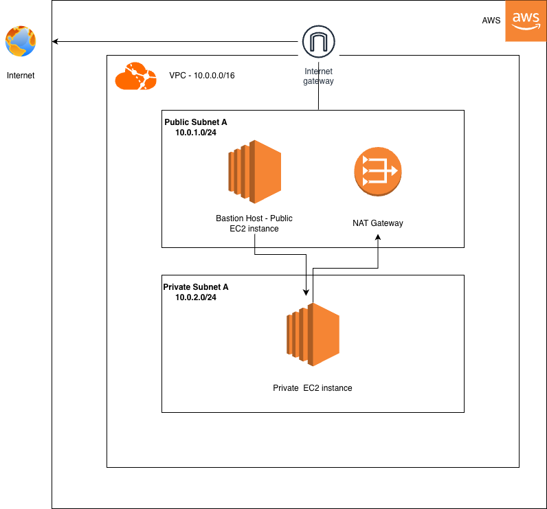
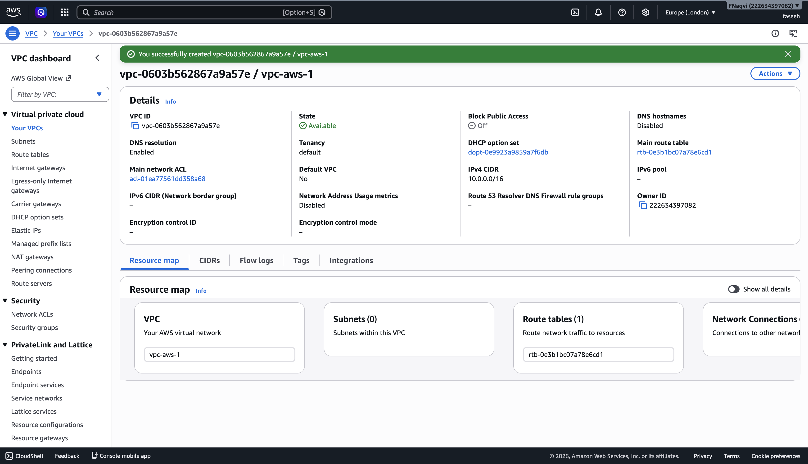
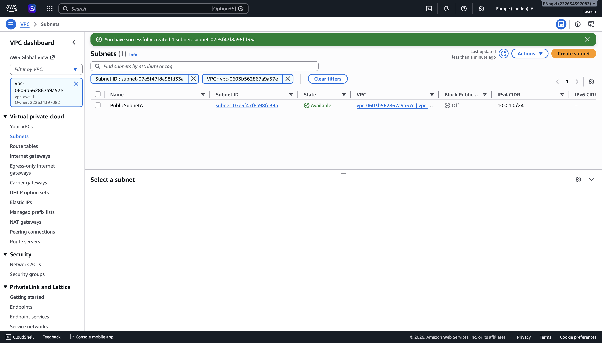
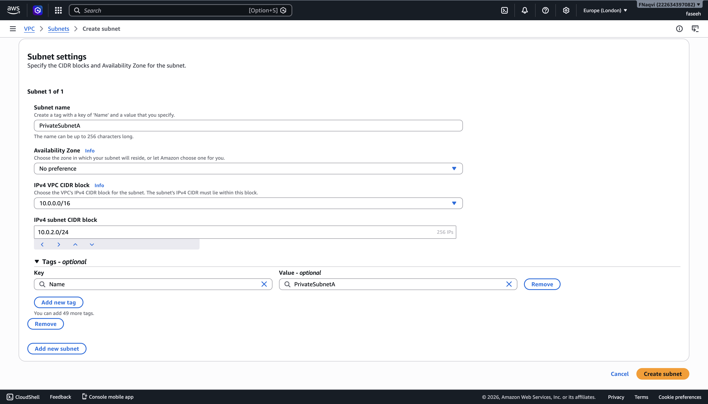
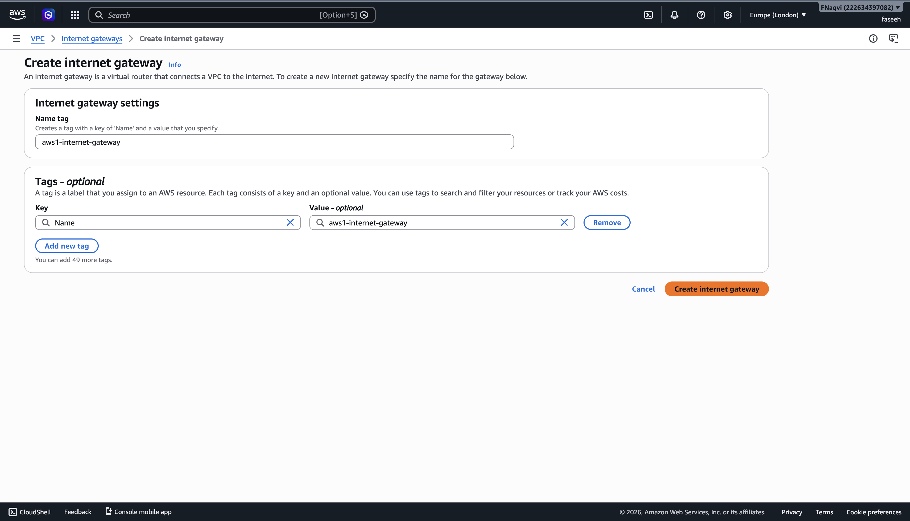
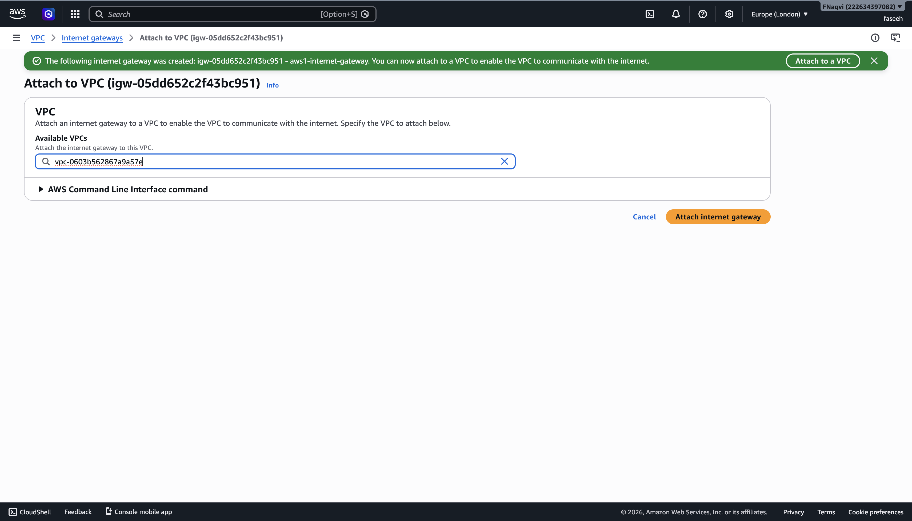
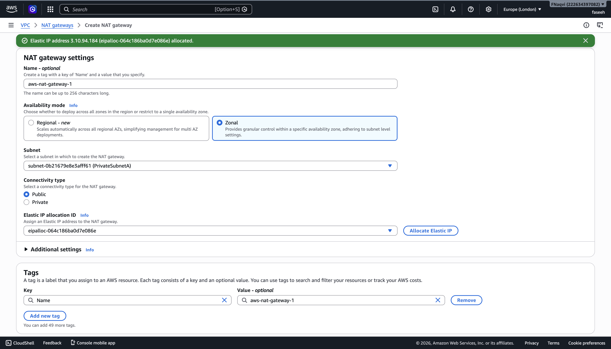
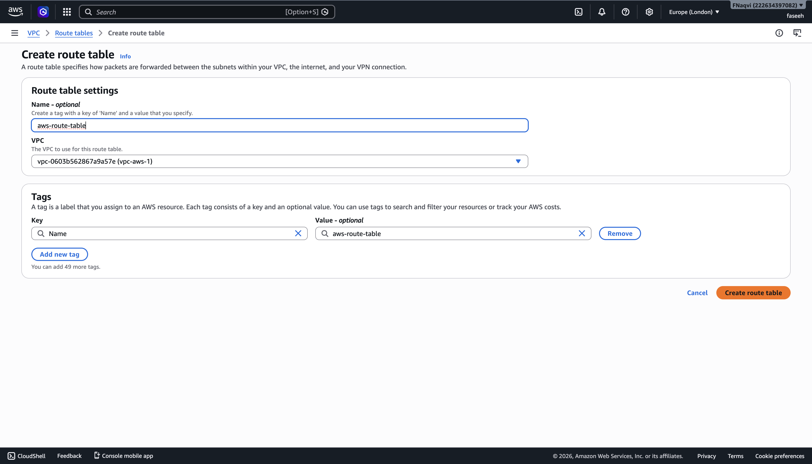
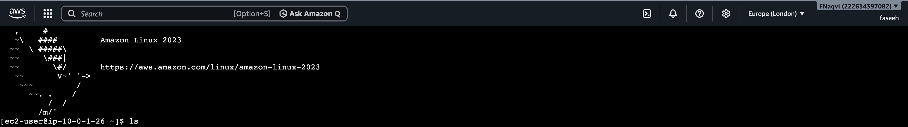
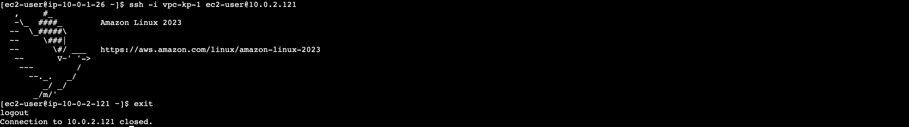

# AWS Assignment 1 — VPC & Networking

## Overview
In this assignment, I provisioned a custom VPC on AWS from scratch, implementing a public and private subnet. I configured internet access for both subnets - an Internet Gateway for the public subnet, and a NAT Gateway for the private subnet - and deployed EC2 instances in each. I then used a Bastion Host to SSH into the private instance, demonstrating a real-world pattern for accessing private infrastructure.

## Architecture Diagram

## What I Built
- Custom VPC (10.0.0.0/16)
- Public and private subnets
- Internet Gateway for public subnet
- NAT Gateway for private subnet outbound access
- Route tables controlling traffic flow
- Public EC2 instance with public IP
- Private EC2 instance without public IP
- Bastion host for secure private access
- Security groups enforcing least privilege

## Architecture Decisions

**Why a public and private subnet?**
Public subnet hosts resources that need internet access — bastion host, 
NAT Gateway. Private subnet hosts resources that should never be directly 
exposed — application servers, databases.

**Why NAT Gateway not Internet Gateway for private subnet?**
NAT Gateway allows private instances to initiate outbound connections without 
being reachable from the internet. Internet Gateway would expose them publicly.

**Why a bastion host?**
Private instances have no public IP and no direct internet route. Bastion host 
in public subnet acts as a secure jump server — the only entry point to 
private infrastructure.

## Screenshots

### VPC Created

### Subnets

### Internet Gateway

### NAT Gateway

### Route Tables

### EC2 Instances Running

### SSH Into Private Instance Via Bastion

## What I Learned

**How public and private subnets differ in routing**
Public subnets have a route directly to the Internet Gateway — 
resources can be reached from and reach the internet directly. 
Private subnets route outbound traffic through NAT Gateway — 
they can initiate connections out but can never be reached 
from the internet. This separation is fundamental to secure 
cloud architecture.

**Why NAT Gateway sits in the public subnet**
NAT Gateway needs internet access to forward requests on behalf 
of private instances. It must sit in the public subnet to use 
the Internet Gateway route. Placing it in the private subnet 
would make it unreachable from the internet — defeating its purpose.

**How security groups act as stateful firewalls**
Unlike NACLs, security groups are stateful — if you allow 
inbound traffic, the response is automatically allowed outbound 
without an explicit rule. I configured the private EC2 security 
group to only allow SSH from the bastion host's security group 
— not from the internet directly.

**The bastion host pattern for secure private access**
A bastion host is a hardened public instance that acts as the 
only SSH entry point to private infrastructure. Instead of 
exposing private instances directly, you SSH to the bastion 
first, then hop to private instances from there.

## Challenges and How I Solved Them

**Challenge:** Security Group not valid for selected VPC
**Solution:** Had to make sure SG was created in correct VPC
**Lesson:** Security groups are VPC-scoped resources — a group created in one VPC cannot be used in another. Always verify which VPC you're working in before creating security group rules

**Challenge:** Forgot to assign a public IP to Bastion Host
**Solution:** Terminated and re-launched new instance, enable assigning of public IP address
**Lesson:** EC2 instances don't automatically get public IPs even in public subnets unless auto-assign is enabled at subnet or instance level. Always verify this before completing setup of any internet-facing resource.

## How To Reproduce
1. Create VPC with CIDR 10.0.0.0/16
2. Create public subnet 10.0.1.0/24
3. Create private subnet 10.0.2.0/24
4. Create and attach Internet Gateway
5. Allocate Elastic IP
6. Create NAT Gateway in public subnet
7. Configure route tables
8. Launch EC2 instances
9. Configure security groups

## Resources Used
- AWS VPC Documentation
- CoderCo DevOps Course
