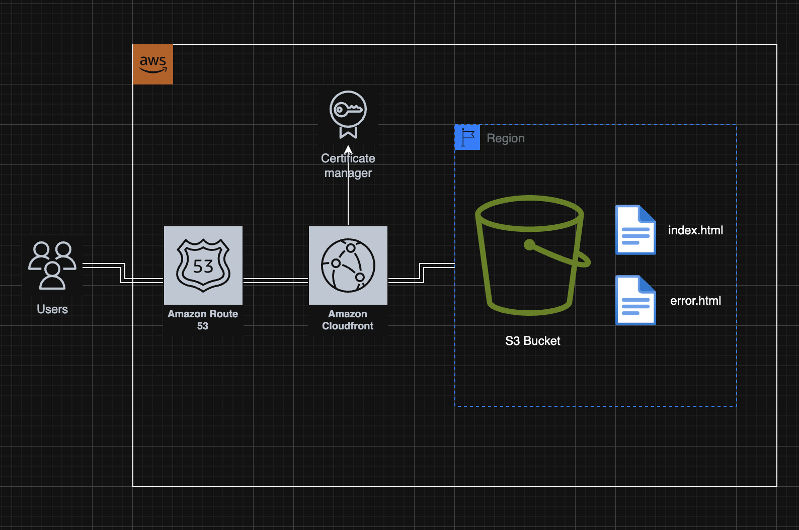
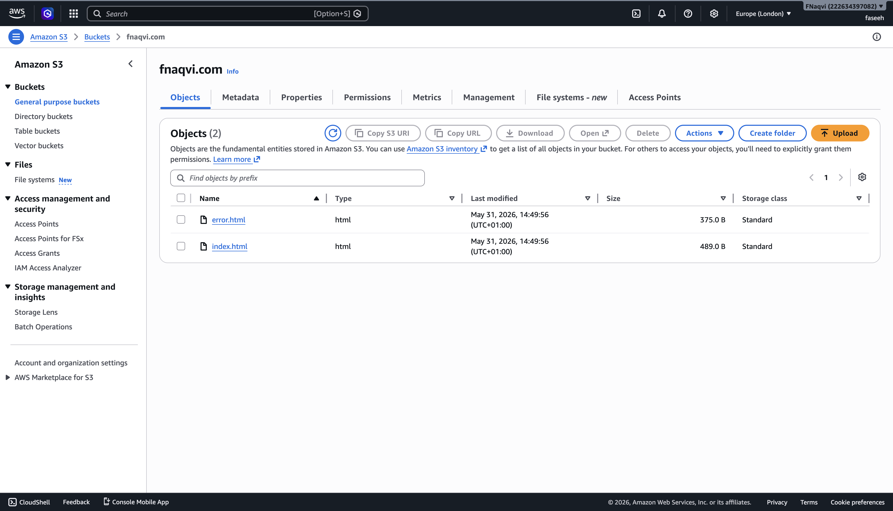
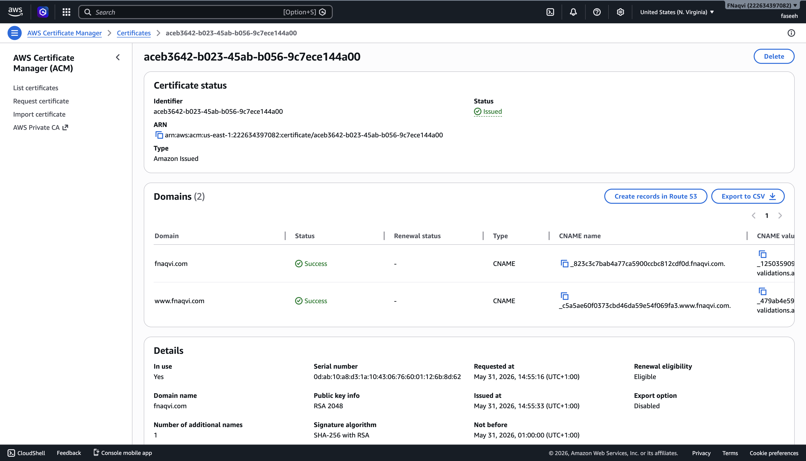
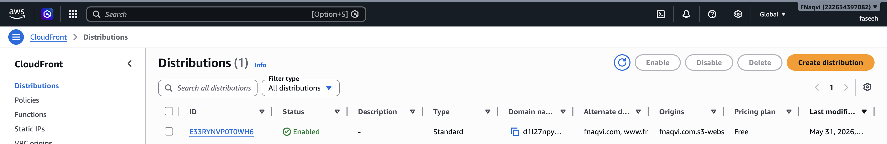
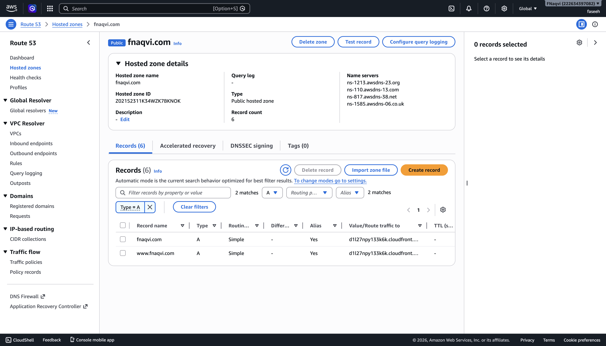
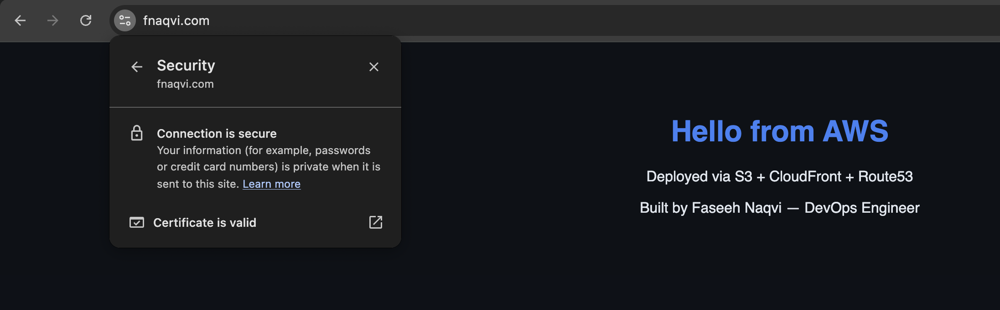
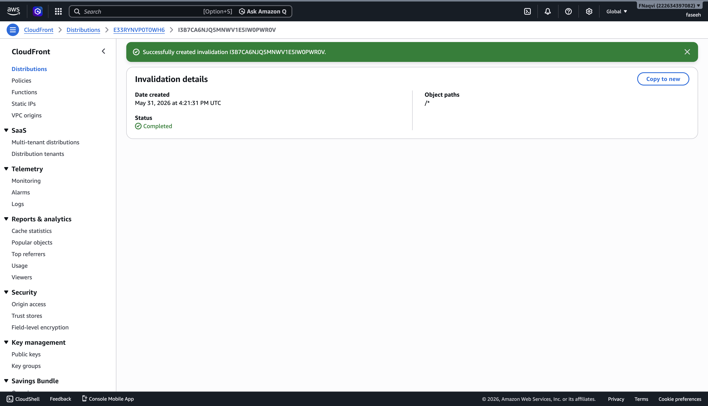

# AWS Assignment 3 — S3 Static Website + CloudFront + Route53

## Overview
In this assignment, I deployed a static website using AWS, using S3 for file storage, CloudFront
as a global CDN, and Route 53 for custom domain routing. I configured ACM to issue an SSL certificate
enabling HTTPS, and connected everything so the site is accessible at fnaqvi.com and www.fnaqvi.com.
This demonstrates a fully serverless static hosting architecture,without the need for VPCs, EC2 instances
or server management.

## Architecture Diagram

## Infrastructure Details

| Resource | Value |
|---|---|
| S3 Bucket | fnaqvi.com |
| Region | eu-west-2 |
| CloudFront Distribution | E33RYNVP0T0WH6 |
| ACM Certificate Region | us-east-1 |
| Domain | fnaqvi.com |

## Architecture Decisions

**Why CloudFront in front of S3?**
S3 alone can serve static website hosting, but has limitations in production use.

- Performance: The S3 bucket is stored in eu-west-2. This means that every request must travel to London
  and back to the user's location. CloudFront caches content at 400+ edge locations golbally. Users are
  connected to the nearest edge location, dramatically reducing latency

- HTTPS: S3 does not support HTTPS on a custom domain. CloudFront with a SSL certificate using ACM enables
  HTTPS connection for users.

- Security: CloudFront acts as a layer between users and the S3 bucket. When using CloudFront, the S3 bucket
  is not directly exposed to the internet

- Cost: CloudFront serves cacjed content withing making needing to access S3 with every request. This reduces
  S3 transfer costs at scale.

**Why ACM certificate must be in us-east-1?**
CloudFront is a global service, with its infrastructure housed in eu-east-1. Therefore, CloudFront can only
access certificates within this region

**Why HTTP only for CloudFront origin protocol?**
S3 website endpoints can only handle HTTP. CloudFront must be configured with HTTP-only protocol, otherwise
the connection times out. This is not a security risk, as the HTTP connection is internal to AWS infrastructure
and never exposed to the internet. Users always connect over HTTPS to CloudFront.

**Why Route53 Alias record not CNAME?**
CNAME records can't be used on a root domain {fnaqvi.com) - they are only valid for sub-domains (www.fnaqvi.com). 
Route 53 Alias records are an AWS-specific record type that work on both root domains and sub-domains. This makes 
them the ideal choice for pointing the domain at the Cloudfront distribution.

AWS Alias records also resolve queries in a single DNS lookup, rather than 2, making them faster. 

## Screenshots

### S3 Bucket — Static Hosting Enabled

### ACM Certificate — Issued

### CloudFront Distribution — Enabled

### Route53 Records

### Site Loading over HTTPS

### CloudFront Cache Invalidation

## What I Learned

**How CloudFront CDN works**
CloudFront is a Content Delivery Network (CDN). It has 400+ locations globally that cache content close to users.

Without CloudFront, every request would have to hit the S3 bucket located in eu-west-2, regardless of where the request 
originates from. This can be slow and inefficient, especially when the user is not based near the S3 bucket region.

With CloudFront, the first request made to an edge location fetches content from the S3 bucket ans caches it locally.
Subsequent users are then served the cached content instantly from the edge location, without needing to touch the S3
bucket. This reduces latency, as well as S3 request costs.

Cloudfront also handles HTTPS connection - users are always securely connected, even though S3 only allows HTTP. 

**Why ACM must be in us-east-1**
CloudFront is a global service with no home region - it has 400+ edge locations worldwide. Because it has no single region,
AWS requires all certificates to be stored in eu-east-1, regardless of where the origin lives.

When creating the ACM certificate, you must manually switch the location to eu-east-1. Certificates created in other regions 
will not appear in the dropdown menu for CloudFront, and cannot be used.

**How cache invalidation works**
When a user sends a request, it will be presented with cached content from the nearest edge location. This reduces latency
dramatically. However, if a change is made in the S3 bucket, this will not be reflected in the content that has already been
cached at an edge location until the TTL expires, causing users to receive outdated content. 

Cache invalidation forces all edge locations to delete their cached content, meaning the next request from a user causes an S3 
request to fetch the most recent content data.

## Challenges and How I Solved Them

**Challenge:** Gateway timeout error
**Root cause:** CloudFront origin protocol was not set to HTTP-only. S3 buckets can only communicate using HTTP - CloudFront could
not access content from the S3 bucket using HTTPS
**Solution:** I changed the origin protocol to HTTP-only
**Lesson:** CloudFront Origin Protocol must be set to HTTP-only when using AN S3 website endpoint as an origin. CloudFront handles
HTTPS termination with users whilst communicating with S3 locally using HTTP.

## What I'd Do Differently
- Set CloudFront Origin to HTTP-only from the start, in order to allow CloudFront to commmunicate with S3 bucket and prevent gateway
  timeout error
- Request ACM certificate before starting any other configuration. ACM certificates can take up to 30 mins to be issued - sterting it
  first removes waiting time in the middle of building
  
## How To Reproduce

1. Switch AWS console region to us-east-1
2. Request ACM public certificate for fnaqvi.com and www.fnaqvi.com
3. Validate certificate via DNS — Route53 creates validation records automatically
4. Wait for certificate status to show Issued — 5-30 minutes
5. Switch back to eu-west-2
6. Create S3 bucket named fnaqvi.com
7. Unblock all public access on the bucket
8. Enable static website hosting
    - Index document: index.html
    - Error document: error.html
10. Add bucket policy for public read access
11. Upload index.html and error.html
12. Test S3 website endpoint directly — verify content loads before proceeding
13. Create CloudFront distribution
    - Origin domain: fnaqvi.com.s3-website.eu-west-2.amazonaws.com
    - Origin protocol: HTTP only
    - Viewer protocol policy: Redirect HTTP to HTTPS
    - Alternate domain names: fnaqvi.com, www.fnaqvi.com
    - ACM certificate: select certificate from us-east-1
    - Default root object: index.html
14. Wait for CloudFront distribution to deploy — 10-15 minutes
15. Create Route53 A record — Alias — fnaqvi.com pointing to CloudFront distribution
16. Create Route53 A record — Alias — www.fnaqvi.com pointing to CloudFront distribution
17. Visit fnaqvi.com — verify HTTPS padlock present
18. Visit www.fnaqvi.com — verify HTTPS padlock present
19. Update index.html and re-upload to S3
20. Verify CloudFront still serves old cached version
21. Create CloudFront invalidation — /*
22. Wait 1-2 minutes — verify updated content loads

## Resources Used
- AWS S3 Documentation
- AWS CloudFront Documentation
- CoderCo DevOps Course
