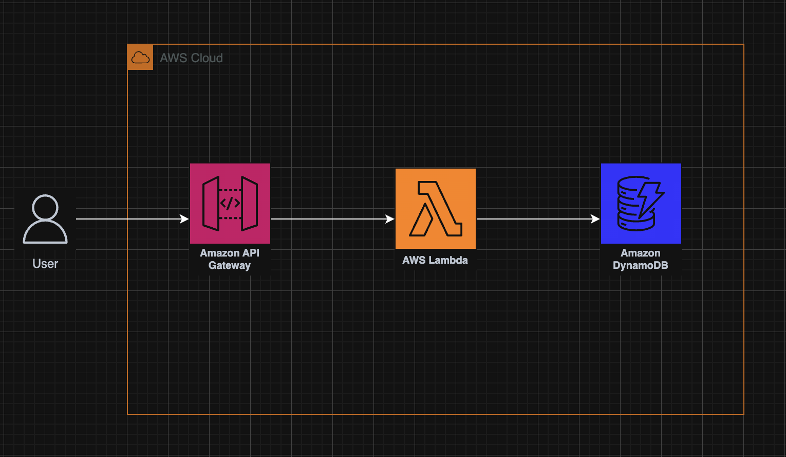
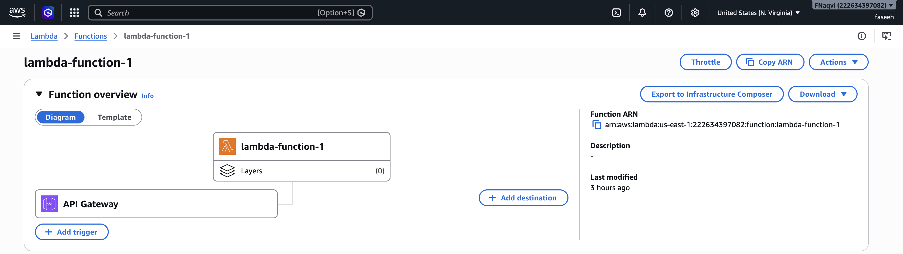
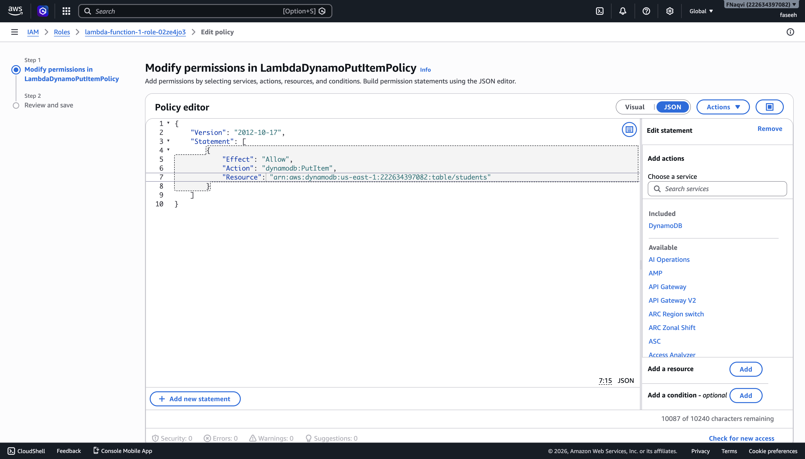
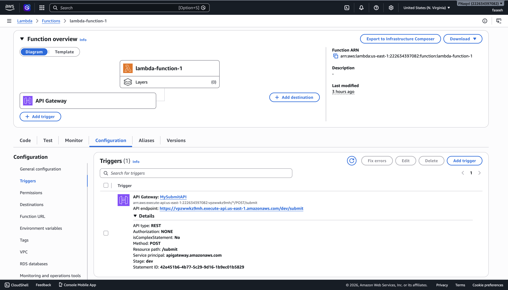
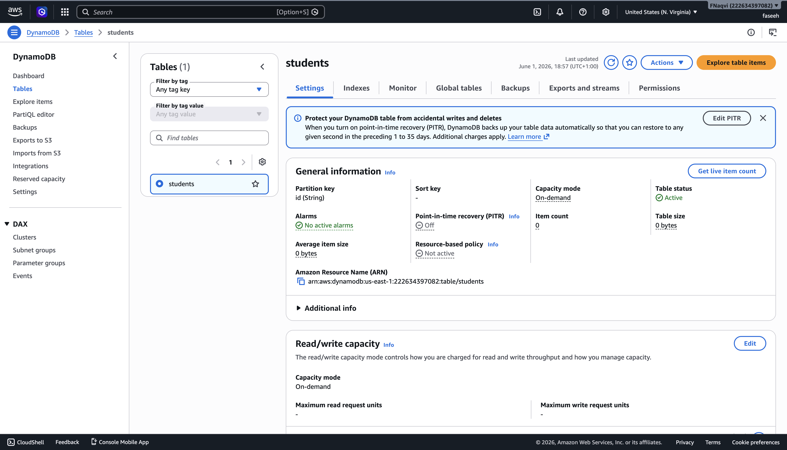
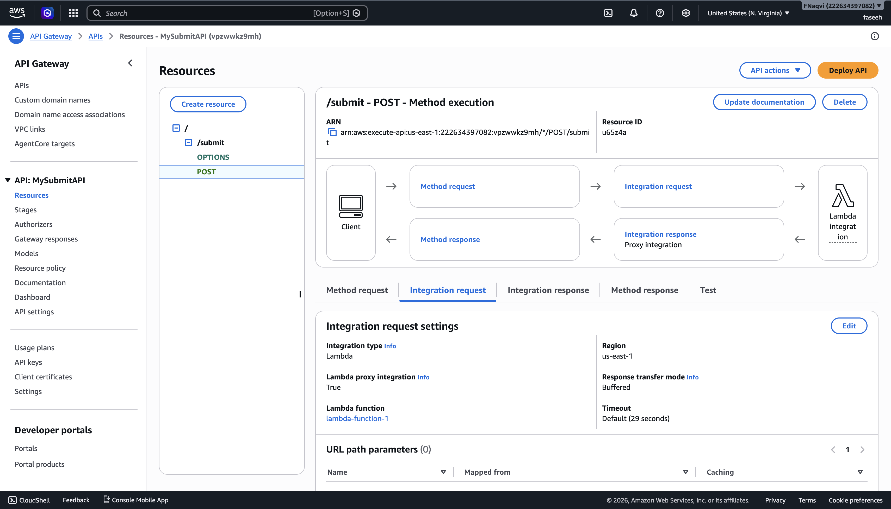
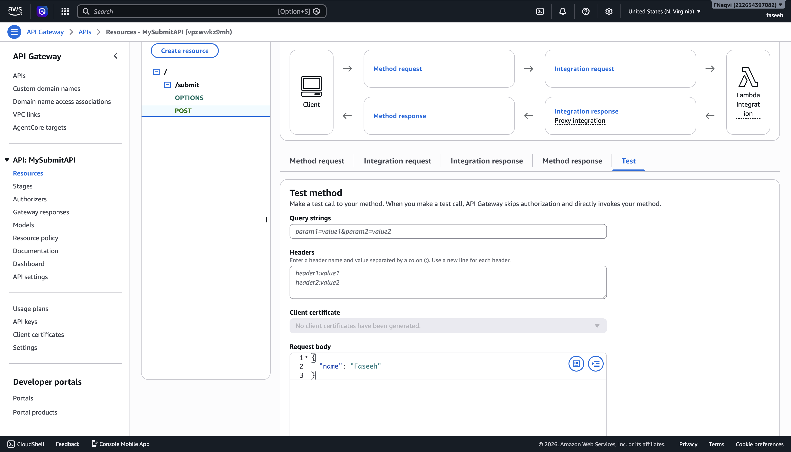

# AWS Assignment 4

## Overview
In this assignment, I configured and deployed a Lambda function, sitting behind an API gateway. Sending
a request to the API endpoint triggers the Lambda Function, which processes the payload and generates a 
Unique Identifier, storing it in a DynamoDB table. Using IAM permissions, Lambda only has basic logging
permissions, and write access to DynamoDB. This demonstrates a fully serverless architecture, where 
backend data storage is handled without needing to manage VPCs, EC2 instances, or server management.

## Architecture Diagram



## What I built
- Lambda function - node.js runtime - generates UUID, writes to DynamoDB
- DynamoDB table - students - with id as partition key
- API Gateway REST API - POST /submit endpoint
- IAM Execution Role - IAM Least Privilege - basic logging permissions and DynamoDB write access only
- Lambda proxy integration connecting API Gateway to Lambda

## Architecture Decisions

- Using DynamoDB rather than a traditonal server: Previously, renting a server was required to store data. It
  had to be kept running at all times, updated manually, and would cost even when there was no usage. DynamoDB
  is a fully managed, noSQL database and, when configured with Lambda, becomes event-driven, meaning that
  code is only run when needed. This dramatically reduces operating costs. It also improves scalability, and
  removes the need for manual server management.

- Using an API Gateway: Lambda on its own cannot be directly accessed through the internet. To handle this,
  configuring an API gateway to sit in front of the function. This allows users to send requests to a public API
  endpoint. When a request is received, the API gateway triggers the Lambda function, allowing the backend code
  to execute in response. This setup creates a secure and scalable way to expose serverless functions to the
  internet.

- Deploying a Lambda function: AWS Lambda is completely serverless, meaning that there is no requirement for
  managing physical infrastructure. It allows for automatic scaling, and is cost-effective at scale, as users
  only pay for the code-compute time. Workloads are also distributed across multiple Availability Zones, giving
  it high availability.

## Screenshots













## Lambda Code

```
import { DynamoDBClient } from "@aws-sdk/client-dynamodb";
import { DynamoDBDocumentClient, PutCommand } from "@aws-sdk/lib-dynamodb";
import { randomUUID } from "crypto";

const client = new DynamoDBClient({});
const ddb = DynamoDBDocumentClient.from(client);

export const handler = async (event) => {
  console.log("Incoming event:", JSON.stringify(event));

  try {
    // Parse request body (API Gateway sends string)
    const payload = typeof event.body === "string"
      ? JSON.parse(event.body)
      : event.body;

    if (!payload) {
      throw new Error("Missing request body");
    }

    // Create item
    const item = {
      id: randomUUID(),
      timestamp: new Date().toISOString(),
      payload
    };

    console.log("Saving item to DynamoDB:", item);

    // Store in DynamoDB
    await ddb.send(
      new PutCommand({
        TableName: process.env.TABLE_NAME,
        Item: item
      })
    );

    console.log("Successfully saved item:", item.id);

    return {
      statusCode: 201,
      headers: {
        "Content-Type": "application/json"
      },
      body: JSON.stringify({
        success: true,
        message: "Item stored successfully",
        data: item
      })
    };

  } catch (error) {
    console.error("Error occurred:", error);

    return {
      statusCode: 500,
      headers: {
        "Content-Type": "application/json"
      },
      body: JSON.stringify({
        success: false,
        message: "Failed to store item",
        error: error.message
      })
    };
  }
};
```

## What I Learned

- IAM Least Privilege in practice: Rather than giving Lambda broad permissions, the execution role was configured
  only with that is specifically needed - in this case it was basic logging permissions and DynamoDB write access.
  This ensures that, if Lambda is ever compromised, the damage radius is minimised only to what Lambda has permission
  for.

- How event-driven architecture works: For event-driven architecture, the entire system sits idle until a request hits
  the API endpoint. This means that there is no cost being accrued whilst the system is not in use. A POST request
  hitting the endpoint triggers Lambda, processes the request, writes to the DynamoDB table, and subsequently returns
  to idle. This allows Lambda functions to be extremely cost-effectve compared to traditional servers, that must be run 24/7.

- How proxy integration simplifies API development: Without proxy integration, the API's default action to a request
  would be to translate the request using mapping templates before passing it on to Lambda. It would then re-translate
  the response from Lambda to make it compatible with HTTP. However, with proxy integration, the API can send the entire
  HTTP request to Lambda without the need for translation - Lambda controls the entire response. This is much simpler than
  creating mapping templates that the API can use to translate requests both ways.

- What CORS does: Browsers block requests to different domains by default. CORS headers tell the browser that cross-origin
  requests are permitted. Without it, a frontend application would not be able to call the API.

## Challenges and How I Solved Them 

**Challenge:** Clicking the API Gateway endpoint URL in the browser returned "Missing Authentication Token"
**Root cause:** Browsers always send GET requests when clicking a URL. The API only has a POST /submit endpoint configured — 
GET requests to that path return 403 because no GET method exists. The error message is misleading — it suggests an 
authentication issue but actually means the route or method doesn't exist.
**Solution:** Used the API Gateway test console to send a POST request with a JSON payload directly — Lambda triggered 
successfully and returned a 200 response.
**Lesson:** REST APIs are not designed to be accessed via browser URL. POST requests with JSON payloads require dedicated 
tools — curl, Postman, or the API Gateway test console. The Missing Authentication Token error in API Gateway typically means 
the route or HTTP method doesn't exist rather than a genuine authentication problem.
  
## How To Reproduce

1. Create a DynamoDB table with id as the partition key.
2. Create a Lambda function using the Node.js runtime.
3. Configure the Lambda environment variable containing the DynamoDB table name.
4. Implement and deploy the Lambda code to generate a UUID, add a timestamp, and store data in DynamoDB.
5. Create and attach an IAM policy allowing the Lambda function to perform dynamodb:PutItem.
6. Create a REST API in API Gateway.
7. Create a /submit resource with a POST method and integrate it with the Lambda function using Lambda Proxy Integration.
8. Enable CORS on the endpoint.
9. Deploy the API to a dev stage.
10. Send a POST request to the deployed endpoint and verify that the data is stored in DynamoDB.

## Resources Used

- AWS Lambda Documentation
- AWS DynamoDB Documentation
- AWS API Documentation
- CoderCo DevOps Course
